#### From NASA

"Copyright protection ... is not available for \[a work prepared by an officer or employee of the United States Government as part of that person’s official duties\]." — 17 U.S.C. § 101, 105.

Emoji|Spacecraft
-----|----------
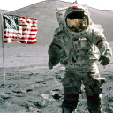|Apollo 17
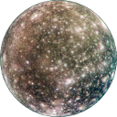|_Galileo_
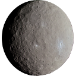|_Dawn_
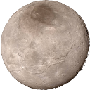|_New Horizons_
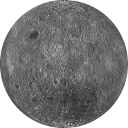|Lunar Reconnaissance Orbiter
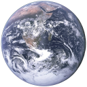|Apollo 17
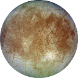|_Galileo_
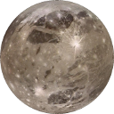|_New Horizons_
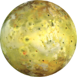|_Galileo_
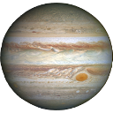|Hubble Space Telescope
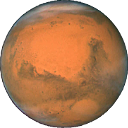|Hubble Space Telescope
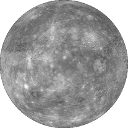|_Messenger_
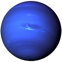|Voyager 2
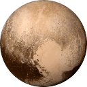|_New Horizons_
|Voyager 2
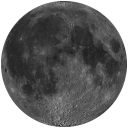|Lunar Reconnaissance Orbiter
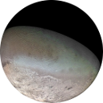|Voyager 2
|Voyager 2
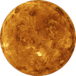|Magellan
