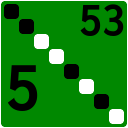
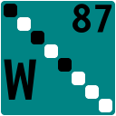
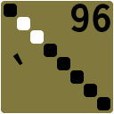
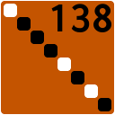
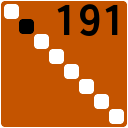
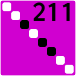
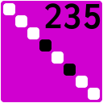

These were generated by [a script written by Jude](../../Scripts/Generate%20byte%20emoji.linq).

Each byte depicts its bits on its upper-left-to-lower-right diagonal. The most significant bit is in the upper left. White depicts a 1, and black depicts a 0. The decimal value is in the upper right corner.

The color coding indicates the role of the byte in the UTF8 encoding. Therefore, for the the lower half, it also reflects the ASCII encoding.

Color|Meaning
-----|-------
|Control character
|Punctuation
|Digit
|Uppercase letter
|Lowercase letter
|Muli-byte sequence continuation
|Multi-byte sequence start
|Invalid

Bytes that encode an entire character in UTF8 depict that character in the bottom left.

Obviously, not all bytes are encoding strings, so the color and representation of the character are sometimes irrelevant.

...000|...001|...010|...011|...100|...101|...110|...111
------|------|------|------|------|------|------|------
|||||||
|||||||
|||||||
|||||||
|||||||
|||||||
|||||||
|||||||
|||||||
|||||||
|||||||
|||||||
|||||||
|||||||
|||||||
|||||||
|||||||
|||||||
|||||||
|||||||
|||||||
|||||||
|||||||
|||||||
|||||||
|||||||
|||||||
|||||||
|||||||
|||||||
|||||||
|||||||
