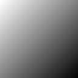

These were all made by Jude.

Emoji|Notes
-----|-----
|This is a gradient from #757575 to #767676, the full range of greys that have sufficient contrast, 4.5, to meet WCAG 2.0 level AA against both pure black and pure white backgrounds.
|This can be useful for laying out grids of emoji.
|These are two shades of gold.
|This is a gradient from pure white to pure black.
|These are two shades of purple.