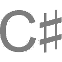
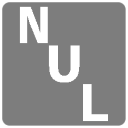
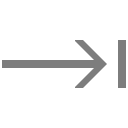

Emoji|Notes
-----|-----
|Jude drew this.
|This is simple text
|Jude drew this.
|This is simple text.
|This lacks the originality necessary for copyright.
|Jude drew this.
|[The source](https://commons.wikimedia.org/wiki/File:ISOIEC-9995-7-029--ISO-7000-2029--Symbol-for-Escape.svg), which depicts an internationally standardized symbol per specification, was explicitly released into the public domain by its creators.
|This is simple text.
|Jude drew this.
|Jude drew this.
