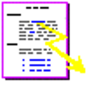
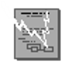
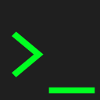
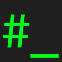
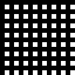
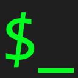

#### From WorldWideWeb

The [first web browser was written at CERN](https://worldwideweb.cern.ch/) by [Tim Berners-Lee](https://www.w3.org/People/Berners-Lee/Overview.html) then a growing team. It was [initially named WorldWideWeb](https://www.w3.org/People/Berners-Lee/WorldWideWeb.html). It was released into the public domain by CERN on April 30, 1993. These icons are from that release. They have been very lightly processed.

Emoji|Original File Name|Notes
-----|------------------|-----
|docflash2.tiff|This seems to be the associated HTML file icon.
|worldbook2.tiff|The WWW Virtual Library
|icon1.tiff|This is the icon for WorldWideWeb itself.

#### Made by Jude

Emoji|Notes
-----|-----
|
|
|
|
|
|This is both the logo for this project and a depiction of a real [switch register](https://commons.wikimedia.org/wiki/File:Digital_PDP11-IMG_1498_cropped.jpg). The values shown are ASCII (and UTF-8) S and R.
|
|
