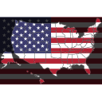

In general, the silhouette of a country lacks the originality necessary for copyright.

Emoji|Notes
-----|-----
|This was composed by Jude from a US flag and the outline of (much of) the USA. The flag is not subject to copyright protection per 17 U.S.C. § 101, 105. The outline of a country lacks the originality necessary for copyright.