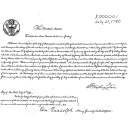
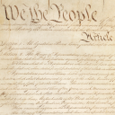

#### From United States Government

"Copyright protection ... is not available for \[a work prepared by an officer or employee of the United States Government as part of that person’s official duties\]." — 17 U.S.C. § 101, 105.

Emoji|Source|Note
-----|------|----
|First US Patent|This is also much too old for copyright protection to still apply.
|An early copy of the US Constitution|This is also much too old for copyright protection to still apply.