#### Silhouettes

In general, the silhouette of a country, a political subdivision of one, a continent, or any other well-defined region lacks the originality necessary for copyright.

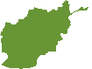
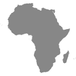

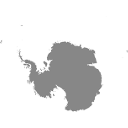
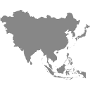
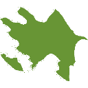
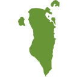

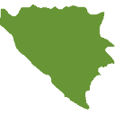

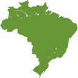

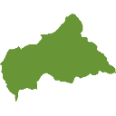
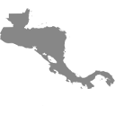
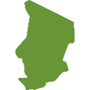

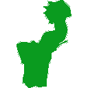
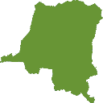
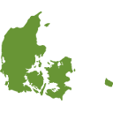

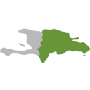
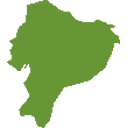

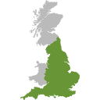

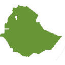
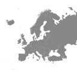
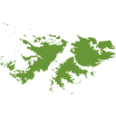
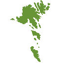
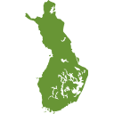
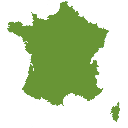
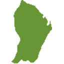

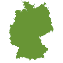

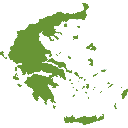
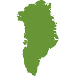
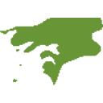
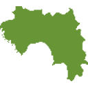

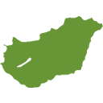

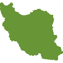
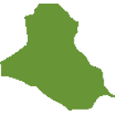
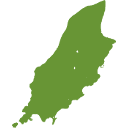
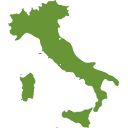

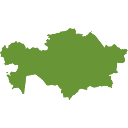
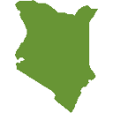

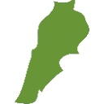
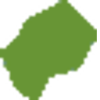
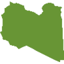
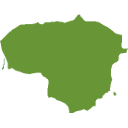
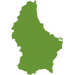
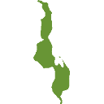
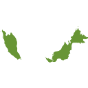

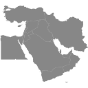
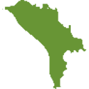

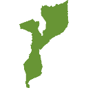
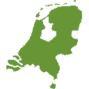
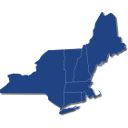
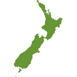
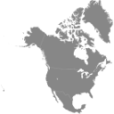

##### Reserved for Internationalization by Slack

Slack won't take a large fraction of these because they've reserved the names for internationalization. The reason only some are reserved isn't clear.

#### Composed

Emoji|Notes
-----|-----
|This was composed by Jude from a US flag and the outline of (much of) the USA. The flag is not subject to copyright protection per 17 U.S.C. § 101, 105.
