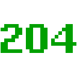
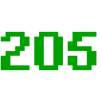

These are [per IANA](https://www.iana.org/assignments/http-status-codes/http-status-codes.xhtml) with references to [IETF RFCs](https://www.ietf.org/standards/rfcs/). 418 isn't in IANA's list; however, there are (April Fools' Day) RFCs, and the number is unlikely to ever be reused.

The digits are a 6-times upscale of a [recreation of the original WorldWideWeb browser's stock font](https://worldwideweb.cern.ch/typography/). The color coding was done by Jude, and it doesn't match any particular standard.

Emoji|Name|Reference
-----|----|---------
|Continue|[RFC7231 §6.2.1](https://tools.ietf.org/html/rfc7231#section-6.2.1)
|Switching Protocols|[RFC7231 §6.2.2](https://tools.ietf.org/html/rfc7231#section-6.2.2)
|Processing|[RFC2518 §10.1](https://tools.ietf.org/html/rfc2518#section-10.1)
|Early Hints|[RFC8297 §2](https://tools.ietf.org/html/rfc8297#section-2)
|OK|[RFC1945 §9.2](https://tools.ietf.org/html/rfc1945#section-9.2), [RFC7231 §6.3.1](https://tools.ietf.org/html/rfc7231#section-6.3.1)
|Created|[RFC1945 §9.2](https://tools.ietf.org/html/rfc1945#section-9.2), [RFC7231 §6.3.2](https://tools.ietf.org/html/rfc7231#section-6.3.2)
|Accepted|[RFC1945 §9.2](https://tools.ietf.org/html/rfc1945#section-9.2), [RFC7231 §6.3.3](https://tools.ietf.org/html/rfc7231#section-6.3.3)
|Non-Authoritative Information|[RFC7231 §6.3.4](https://tools.ietf.org/html/rfc7231#section-6.3.4)
|No Content|[RFC1945 §9.2](https://tools.ietf.org/html/rfc1945#section-9.2), [RFC7231 §6.3.5](https://tools.ietf.org/html/rfc7231#section-6.3.5)
|Reset Content|[RFC7231 §6.3.6](https://tools.ietf.org/html/rfc7231#section-6.3.6)
|Partial Content|[RFC7233 §4.1](https://tools.ietf.org/html/rfc7233#section-4.1)
|Multi-Status|[RFC2518 §10.2](https://tools.ietf.org/html/rfc2518#section-10.2), [RFC4918 §11.1](https://tools.ietf.org/html/rfc4918#section-11.1)
|Already Reported|[RFC5842 §7.1](https://tools.ietf.org/html/rfc5842#section-7.1)
|IM Used|[RFC3229 §10.4.1](https://tools.ietf.org/html/rfc3229#section-10.4.1)
|Multiple Choices|[RFC1945 §9.3](https://tools.ietf.org/html/rfc1945#section-9.3), [RFC7231 §6.4.1](https://tools.ietf.org/html/rfc7231#section-6.4.1)
|Moved Permanently|[RFC1945 §9.3](https://tools.ietf.org/html/rfc1945#section-9.3), [RFC7231 §6.4.2](https://tools.ietf.org/html/rfc7231#section-6.4.2)
|Found|[RFC1945 §9.3](https://tools.ietf.org/html/rfc1945#section-9.3), [RFC7231 §6.4.3](https://tools.ietf.org/html/rfc7231#section-6.4.3)
|See Other|[RFC7231 §6.4.4](https://tools.ietf.org/html/rfc7231#section-6.4.4)
|Not Modified|[RFC1945 §9.3](https://tools.ietf.org/html/rfc1945#section-9.3), [RFC7232 §4.1](https://tools.ietf.org/html/rfc7232#section-4.1)
|Use Proxy|[RFC7231 §6.4.5](https://tools.ietf.org/html/rfc7231#section-6.4.5)
|*in drafts only* Switch Proxy|[RFC7231 §6.4.6](https://tools.ietf.org/html/rfc7231#section-6.4.6)
|Temporary Redirect|[RFC7231 §6.4.7](https://tools.ietf.org/html/rfc7231#section-6.4.7)
|Permanent Redirect|[RFC7538 §3](https://tools.ietf.org/html/rfc7538#section-3)
|Bad Request|[RFC1945 §9.4](https://tools.ietf.org/html/rfc1945#section-9.4), [RFC7231 §6.5.1](https://tools.ietf.org/html/rfc7231#section-6.5.1)
|Unauthorized|[RFC1945 §9.4](https://tools.ietf.org/html/rfc1945#section-9.4), [RFC7235 §3.1](https://tools.ietf.org/html/rfc7235#section-3.1)
|Payment Required|[RFC7231 §6.5.2](https://tools.ietf.org/html/rfc7231#section-6.5.2)
|Forbidden|[RFC1945 §9.4](https://tools.ietf.org/html/rfc1945#section-9.4), [RFC7231 §6.5.3](https://tools.ietf.org/html/rfc7231#section-6.5.3)
|Not Found|[RFC1945 §9.4](https://tools.ietf.org/html/rfc1945#section-9.4), [RFC7231 §6.5.4](https://tools.ietf.org/html/rfc7231#section-6.5.4)
|Method Not Allowed|[RFC7231 §6.5.5](https://tools.ietf.org/html/rfc7231#section-6.5.5)
|Not Acceptable|[RFC7231 §6.5.6](https://tools.ietf.org/html/rfc7231#section-6.5.6)
|Proxy Authentication Required|[RFC7235 §3.2](https://tools.ietf.org/html/rfc7235#section-3.2)
|Request Timeout|[RFC7231 §6.5.7](https://tools.ietf.org/html/rfc7231#section-6.5.7)
|Conflict|[RFC7231 §6.5.8](https://tools.ietf.org/html/rfc7231#section-6.5.8)
|Gone|[RFC7231 §6.5.9](https://tools.ietf.org/html/rfc7231#section-6.5.9)
|Length Required|[RFC7231 §6.5.10](https://tools.ietf.org/html/rfc7231#section-6.5.10)
|Precondition Failed|[RFC7232 §4.2](https://tools.ietf.org/html/rfc7232#section-4.2), [RFC4918 §12.1](https://tools.ietf.org/html/rfc4918#section-12.1), [RFC8144 §3.2](https://tools.ietf.org/html/rfc8144#section-3.2)
|Payload Too Large|[RFC7231 §6.5.11](https://tools.ietf.org/html/rfc7231#section-6.5.11)
|URI Too Long|[RFC7231 §6.5.12](https://tools.ietf.org/html/rfc7231#section-6.5.12), [RFC4918 §12.2](https://tools.ietf.org/html/rfc4918#section-12.2)
|Unsupported Media Type|[RFC7231 §6.5.13](https://tools.ietf.org/html/rfc7231#section-6.5.13), [RFC7694 §3](https://tools.ietf.org/html/rfc7694#section-3)
|Range Not Satisfiable|[RFC7233 §4.4](https://tools.ietf.org/html/rfc7233#section-4.4)
|Expectation Failed|[RFC7231 §6.5.14](https://tools.ietf.org/html/rfc7231#section-6.5.14)
|I'm a Teapot|[RFC 2324 §2.3.2](https://tools.ietf.org/html/rfc2324#section-2.3.2), [RFC 7168 §2.3.3](https://tools.ietf.org/html/rfc7168#section-2.3.3)
|Misdirected Request|[RFC7540 §9.1.2](https://tools.ietf.org/html/rfc7540#section-9.1.2)
|Unprocessable Entity|[RFC2518 §10.3](https://tools.ietf.org/html/rfc2518#section-10.3), [RFC4918 §11.2](https://tools.ietf.org/html/rfc4918#section-11.2)
|Locked|[RFC2518 §10.4](https://tools.ietf.org/html/rfc2518#section-10.4), [RFC4918 §11.3](https://tools.ietf.org/html/rfc4918#section-11.3)
|Failed Dependency|[RFC2518 §10.5](https://tools.ietf.org/html/rfc2518#section-10.5), [RFC4918 §11.4](https://tools.ietf.org/html/rfc4918#section-11.4)
|Too Early|[RFC8470 §5.2](https://tools.ietf.org/html/rfc8470#section-5.2)
|Upgrade Required|[RFC7231 §6.5.15](https://tools.ietf.org/html/rfc7231#section-6.5.15)
|Precondition Required|[RFC6585 §3](https://tools.ietf.org/html/rfc6585#section-3)
|Too Many Requests|[RFC6585 §4](https://tools.ietf.org/html/rfc6585#section-4)
|Request Header Fields Too Large|[RFC6585 §5](https://tools.ietf.org/html/rfc6585#section-5)
|Unavailable For Legal Reasons|[RFC7725 §3](https://tools.ietf.org/html/rfc7725#section-3)
|Internal Server Error|[RFC1945 §9.5](https://tools.ietf.org/html/rfc1945#section-9.5), [RFC7231 §6.6.1](https://tools.ietf.org/html/rfc7231#section-6.6.1)
|Not Implemented|[RFC1945 §9.5](https://tools.ietf.org/html/rfc1945#section-9.5), [RFC7231 §6.6.2](https://tools.ietf.org/html/rfc7231#section-6.6.2)
|Bad Gateway|[RFC1945 §9.5](https://tools.ietf.org/html/rfc1945#section-9.5), [RFC7231 §6.6.3](https://tools.ietf.org/html/rfc7231#section-6.6.3)
|Service Unavailable|[RFC1945 §9.5](https://tools.ietf.org/html/rfc1945#section-9.5), [RFC7231 §6.6.4](https://tools.ietf.org/html/rfc7231#section-6.6.4)
|Gateway Timeout|[RFC7231 §6.6.5](https://tools.ietf.org/html/rfc7231#section-6.6.5)
|HTTP Version Not Supported|[RFC7231 §6.6.6](https://tools.ietf.org/html/rfc7231#section-6.6.6)
|Variant Also Negotiates|[RFC2295 §8.1](https://tools.ietf.org/html/rfc2295#section-8.1)
|Insufficient Storage|[RFC2518 §10.6](https://tools.ietf.org/html/rfc2518#section-10.6), [RFC4918 §11.5](https://tools.ietf.org/html/rfc4918#section-11.5)
|Loop Detected|[RFC5842 §7.1](https://tools.ietf.org/html/rfc5842#section-7.2)
|Not Extended|[RFC2774 §7](https://tools.ietf.org/html/rfc2774#section-7)
|Network Authentication Required|[RFC6585 §6](https://tools.ietf.org/html/rfc6585#section-6)
