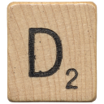
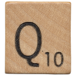
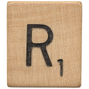

These were cut out by Jude. The picture from which these were cut did not meet the threshold of originality for copyright; it also proved impossible to determine its ultimate source.

These tiles were used by Alfred Mosher Butts for his games, _Lexiko_ and another more famous one. Aliases to names starting with `lexiko_` instead of `tile_` are provided.

