In addition to being international standardized symbols, these are also much too old for copyright protection to still apply.

### ICS Alphabet
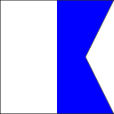
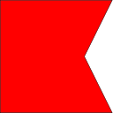
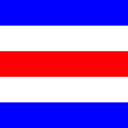
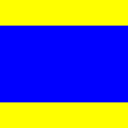
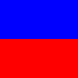
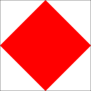
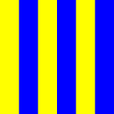
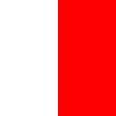
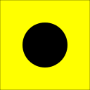

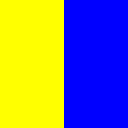
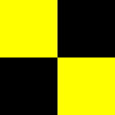
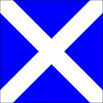
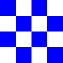
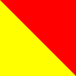

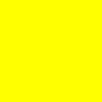
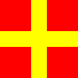

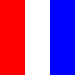
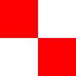
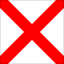
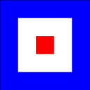
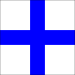
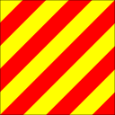
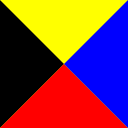

### Digits
#### ICS
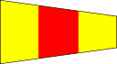
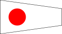
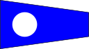
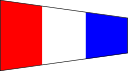

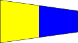

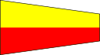
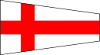
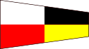
#### NATO
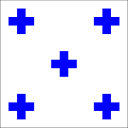
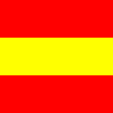
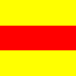
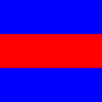
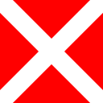
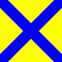
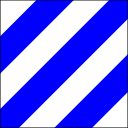

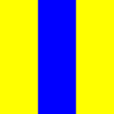
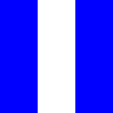

### ICS Answer and Substitutes
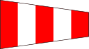
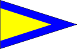
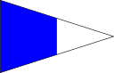
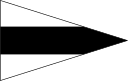
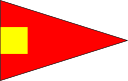
