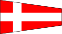
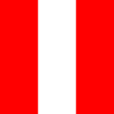

In addition to being international standardized symbols, these are also much too old for copyright protection to still apply.

### ICS Alphabet

### Digits
#### ICS

#### NATO

### ICS Answer and Substitutes

