These are all simple text.

The small amount of colorization was done by Jude.

### Comparisons

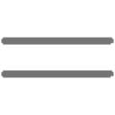

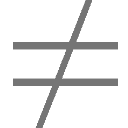

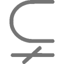
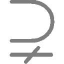

### Constants

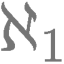
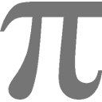

### Geometric

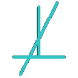

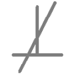
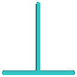
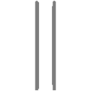
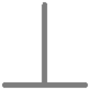

### Integrals

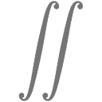
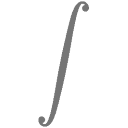

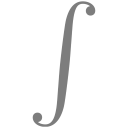
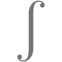
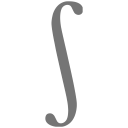
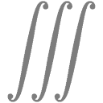

### Limits

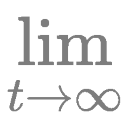
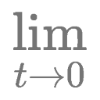
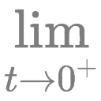
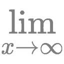
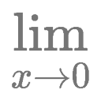
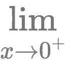
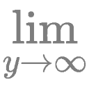
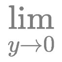
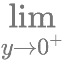

### Logarithms

### Logic

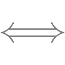

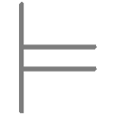
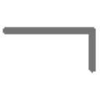

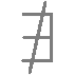

### Operators

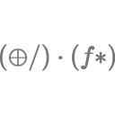

### Partial Derivatives

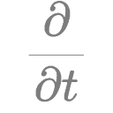
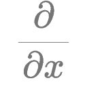
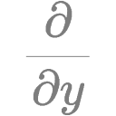
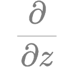

### Sets

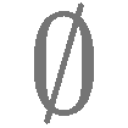

### Set Operations

