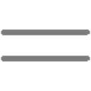
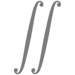
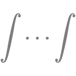
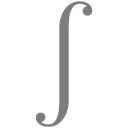
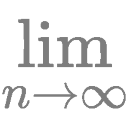
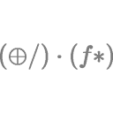
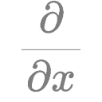

These are all simple text.

The small amount of colorization was done by Jude.

### Comparisons

### Constants

### Geometric

### Integrals

### Limits

### Logarithms

### Logic

### Operators

### Partial Derivatives

### Sets

### Set Operations

