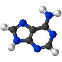
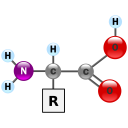
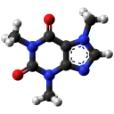
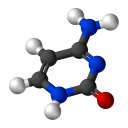
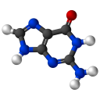
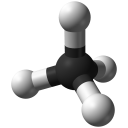
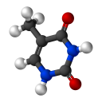
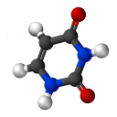

#### From [Wikimedia Commons](https://commons.wikimedia.org/)

These were all released into the public domain by their creators.

Emoji|Source|Creator
-----|------|-------
|[Source](https://commons.wikimedia.org/wiki/File:Adenine-3D-balls.png)|[Vesprcom](https://commons.wikimedia.org/wiki/Special:Contributions/Vesprcom)
|[Source](https://commons.wikimedia.org/wiki/File:AminoAcidball.svg)|[YassineMrabet](https://commons.wikimedia.org/wiki/User:YassineMrabet)
|[Source](https://commons.wikimedia.org/wiki/File:Caffeine_molecule_ball_from_xtal_(1).png)|[Jynto](https://commons.wikimedia.org/wiki/User:Jynto)
|[Source](https://commons.wikimedia.org/wiki/File:Cytosine-3D-balls.png)|[Vesprcom](https://commons.wikimedia.org/wiki/Special:Contributions/Vesprcom)
|[Source](https://commons.wikimedia.org/wiki/File:Guanine-3D-balls.png)|[Vesprcom](https://commons.wikimedia.org/wiki/Special:Contributions/Vesprcom)
|[Source](https://commons.wikimedia.org/wiki/File:Methane-3D-balls.png)|[Benjah-bmm27](https://commons.wikimedia.org/wiki/User:Benjah-bmm27)
|[Source](https://commons.wikimedia.org/wiki/File:Thymine-3D-balls.png)|[Vesprcom](https://commons.wikimedia.org/wiki/Special:Contributions/Vesprcom)
|[Source](https://commons.wikimedia.org/wiki/File:Uracil-3D-balls.png)|[Esquilo](https://commons.wikimedia.org/wiki/User:Esquilo)
