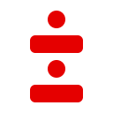

These were all made by Jude.

### Notation

A dash has thrice the duration of a dot. Their appearance in these emoji approximates this.

The silence between each sound within an emoji has the same duration as a dot. The line breaks within these emoji are purely aesthetic and do not reflect anything about proper transmission.

The silence between emoji has the same duration as a dash. This is necessary to determine characters correctly. It also differentiates the [prosigns](https://en.wikipedia.org/wiki/Prosigns_for_Morse_code) from strings of letters.

### Alphabet

### Digits

### Prosigns

### Punctuation

