These were all made by Jude.

The canonical letter abbreviations were standardized by IUPAC in 1970.

There are several exotic nucleobases that are not covered.

Emoji|Notes|Adenine?|Cytosine?|Guanine?|Thymine?|Uracil?
-----|-----|--------|---------|--------|--------|-------
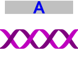|Adenine|Yes| | | |
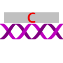|Cytosine| |Yes| | |
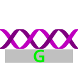|Guanine| | |Yes| |
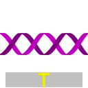|Thymine| | | |Yes|
|Uracil| | | | |Yes
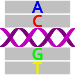|aNy|Maybe|Maybe|Maybe|Maybe in DNA|Maybe in RNA
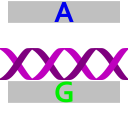|puRine|Maybe|Maybe| | |
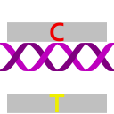|pYrimidine| | |Maybe|Maybe in DNA|Maybe in RNA
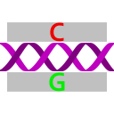|Strong| |Maybe|Maybe| | 
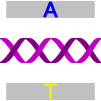|Weak|Maybe| | |Maybe in DNA|Maybe in RNA
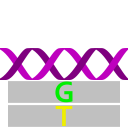|Keto| | |Maybe|Maybe in DNA|Maybe in RNA
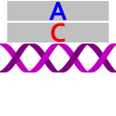|aMino|Maybe|Maybe| | |
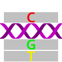|not A| |Maybe|Maybe|Maybe in DNA|Maybe in RNA
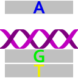|not C|Maybe| |Maybe|Maybe in DNA|Maybe in RNA
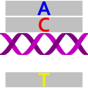|not G|Maybe|Maybe| |Maybe in DNA|Maybe in RNA
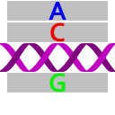|not T or U|Maybe|Maybe|Maybe| |
|Zero possibilities|No|No|No|No|No
