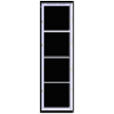

## From United States Armed Forces

"Copyright protection ... is not available for \[a work prepared by an officer or employee of the United States Government as part of that person’s official duties\]." — 17 U.S.C. § 101, 105.

This set is incomplete.

### Air Force
#### Commissioned Officers

### Army
#### Warrant Officers

#### Commissioned Officers

### Marine Corps
#### Warrant Officers

### Navy
#### Commissioned Officers
