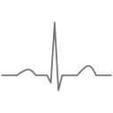
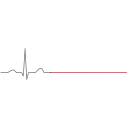
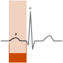
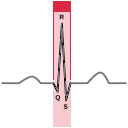
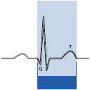
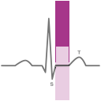

These are based on a [graphic](https://commons.wikimedia.org/wiki/File:SinusRhythmLabels.svg) from Wikimedia Commons released into the public domain by its [creator](https://en.wikipedia.org/wiki/User:Agateller). All modifications from that source were done by Jude.

Intervals, denoted with solid blocks under the line, are important primarily for their durations. Segments, denoted with solid blocks above the line, are important primarily for their shape and position relative to neutral. The PR interval and PR segment also differ in starting time, despite the names.

