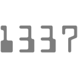
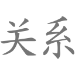
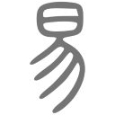
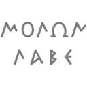
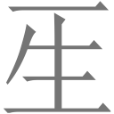

Most of these are just straightforward rendered text.
 
Emoji|Notes
-----|-----
|
|This was created by Jude.
|
|This is a Chinese onomatopoeia for laughter. Its Unicode codepoint is U+54C8.
|This is the title of the _I Ching_ in seal script, an ancient style of writing Chinese.
|This was colorized by Jude.
|This was colorized by Jude.
|This was colorized by Jude.
|This was colorized by Jude.
|This was drawn with the line and ellipse tools in the style of an inscription on the plinth under a statue of Leonidas at Thermopylae.
|
|
|This was created by Jude.
|
|
|This was colorized by Jude.
|This character was one of many introduced by China's only Empress Regnant, Wu Zetian; like most of them, it didn't remain in common use after her reign. It means "human" and contains radicals meaning "one" and "life". Its Unicode codepoint is U+24BD4.
