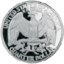

#### From US Bureau of Engraving and Printing

"Copyright protection ... is not available for \[a work prepared by an officer or employee of the United States Government as part of that person’s official duties\]." — 17 U.S.C. § 101, 105.

The situation with anti-counterfeiting laws is more ambiguously worded, but Wikipedia was the source for _much_ higher resolution images and has hosted them for many years.

#### From US Mint

"Copyright protection ... is not available for \[a work prepared by an officer or employee of the United States Government as part of that person’s official duties\]." — 17 U.S.C. § 101, 105.

There are a few coins to which this does not apply because they were created by an outside party who transferred copyright to the US Mint. A notable example is the obverse of the dollar coin depicting Sacagawea. None are present here.  

The situation with anti-counterfeiting laws is more ambiguously worded, but Wikimedia Commons has for many years hosted the _much_ higher resolution source images ultimately from the US Mint.

