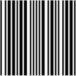
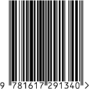

Emoji|Notes
-----|-----
|This is a standardized MICR symbol.
|This is the Code 39 barcode for "39".
|These are two of the standardized MICR symbols.
|This is a standardized MICR symbol.
|This is a standardized MICR symbol.
|This is a QR code for "QRQRQRQR".
|This is a standardized MICR symbol.
|This is the UPC for the third edition of _C# in Depth_ by Jon Skeet.